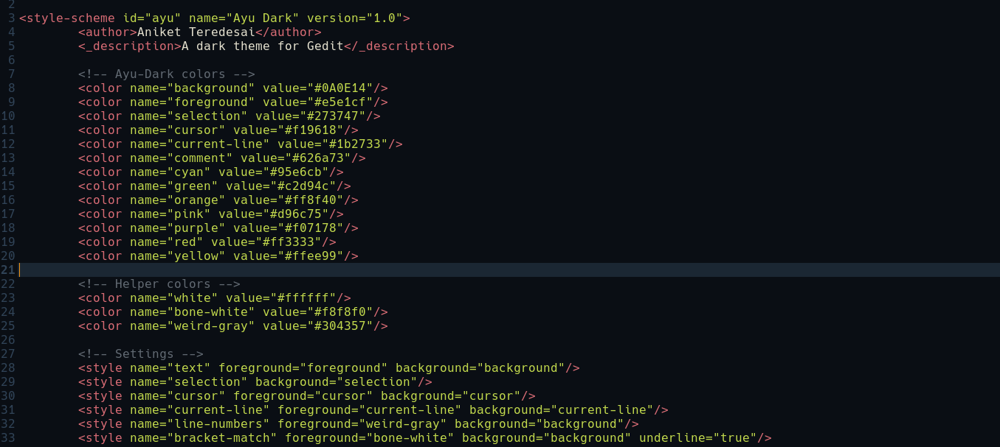

## Yet Another Dark Theme for Gedit based on Ayu-Dark Color Scheme

### Installation
1. Copy the `ayu-dark.xml` theme file to `~/.local/share/gedit/styles` directory. Create the directory if it does not exist.
2. Select the "Ayu Dark" theme in `Gedit>Preferences>Fonts&Colors`.

You can also use `install.sh` script to copy the file to the right place.

Note: `~` is an alias for current user's home directory.